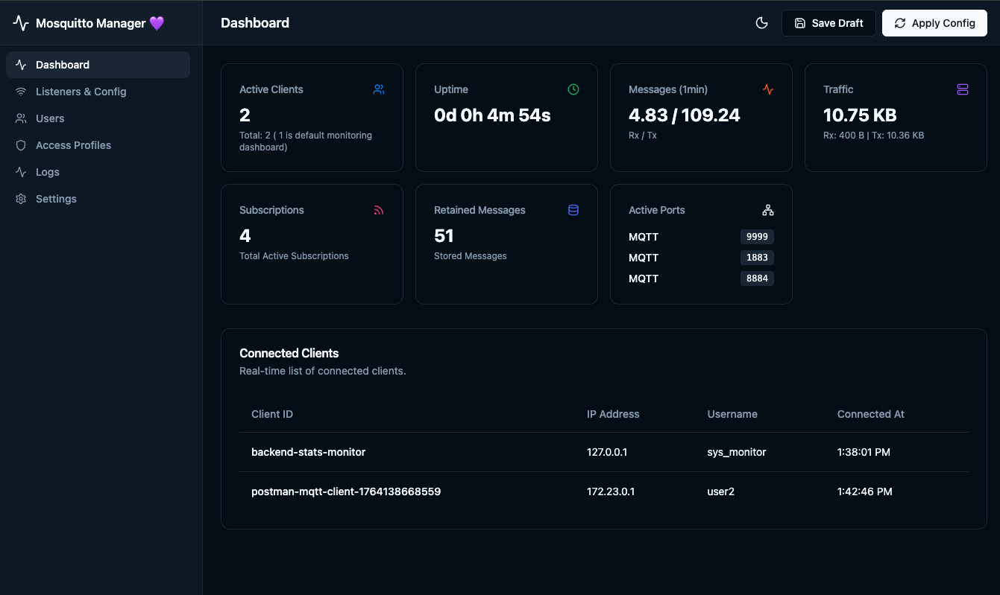
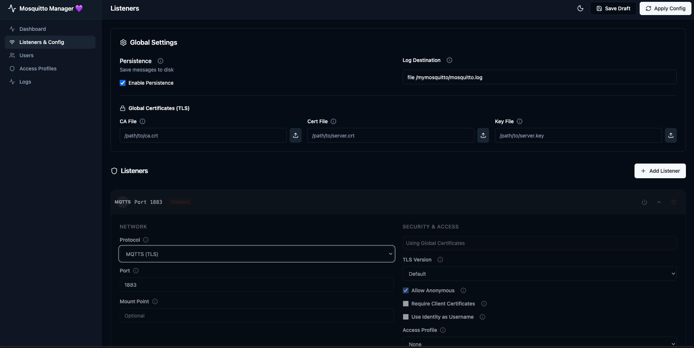
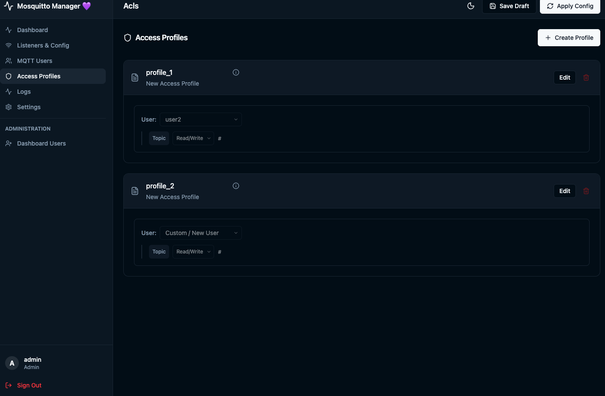
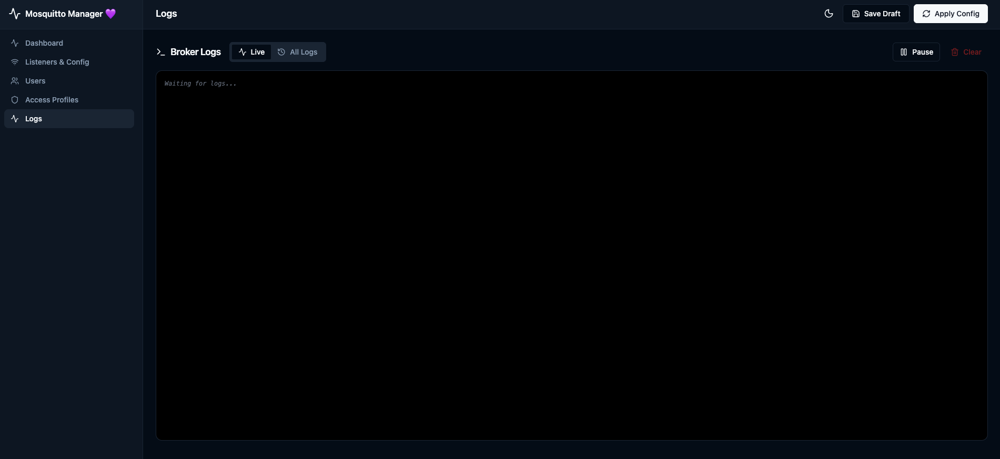

# Mosquitto Manager 💜 ( Self-hosted MQTT/MQTTS made simple with UI )

> **A Community Project**
> *Empowering developers to manage MQTT brokers with ease and style.*



---

## 📋 Table of Contents

- [Why Need Custom MQTT/MQTTS Features?](#-why-need-custom-mqttmqtts-features)
- [Solution Overview](#-solution-overview)
- [Quick Start with Docker](#-quick-start-with-docker)
- [Core Features](#-core-features)
- [Configuration](#-configuration)
- [Architecture](#-architecture)
- [Contributing](#-contributing)
- [License](#-license)

---

## ❓ Why Need Custom MQTT/MQTTS Features?

Setting up a production-ready Mosquitto broker often involves a steep learning curve and manual configuration file management:

*   **Complex Security**: Configuring TLS/SSL certificates (`ca.crt`, `server.crt`, `server.key`) manually is error-prone.
*   **Access Control Hell**: Managing `acl_file` and `password_file` via command line (`mosquitto_passwd`) is tedious and difficult to audit.
*   **Dynamic Requirements**: Modern IoT deployments need to spin up new listeners (e.g., WebSockets for a web dashboard) or add users on the fly without SSH-ing into a server and editing text files.
*   **Visibility**: Standard Mosquitto doesn't provide a built-in dashboard to see who is connected or monitor traffic load in real-time.

**Mosquitto Manager** solves these pain points by providing a modern, user-friendly interface to handle the complexity for you.

---

## 💡 Solution Overview

**Mosquitto Manager** is a fully Dockerized solution that wraps the robust Eclipse Mosquitto broker with a powerful management layer.

*   **Visual Configuration**: No more editing `mosquitto.conf` by hand.
*   **Instant Feedback**: See the status of your broker, active ports, and connected clients immediately.
*   **Secure by Default**: Helps you generate certificates and enforce authentication best practices.
*   **Developer Friendly**: Built with a modern stack (React, Node.js, Docker) to be easily extensible.

---

## 🚀 Quick Start with Docker

Get your broker up and running in minutes.

### Prerequisites
*   [Docker](https://www.docker.com/) installed
*   [Docker Compose](https://docs.docker.com/compose/) installed

### Installation

1.  **Clone the repository**:
    ```bash
    git clone https://github.com/yourusername/mosquitto-manager.git
    cd mosquitto-manager
    ```

2.  **Start the stack**:
    ```bash
    docker-compose up -d --build
    ```

3.  **Access the Dashboard**:
    Open your browser and navigate to:
    👉 **http://localhost:3000**

    **Default Web Credentials:**
    *   **Username**: `admin`
    *   **Password**: `admin`

### Default Ports
*   **3000**: Web Management UI
*   **1883**: Default MQTT Listener
*   **8883**: Default MQTTS Listener (if configured)
*   **9001**: Default WebSocket Listener (if configured)

---

## ✨ Core Features

### 🎧 Listener Management
Easily configure multiple listeners on different ports.
*   **Protocols**: Support for **MQTT**, **MQTTS** (TLS), 
*   **Toggle**: Enable or disable listeners instantly without deleting their config.
*   **Auto-Scroll**: Smart UI that guides you to your newly created listeners.


### future improvement
*   **WebSockets** (WS), and **Secure WebSockets** (WSS).

### 🔒 Advanced Security
*   **TLS/SSL Made Easy**: Upload your own certificates or let the manager generate self-signed certs for development.
*   **Authentication Modes**: Choose between `password_file`, `acl_file`, or allow anonymous access (not recommended for production).
*   **Web Security**: The management dashboard itself is protected by Basic Auth.

### 👥 User & Access Control (ACLs)
*   **User Management**: Create, update, and delete MQTT users. Passwords are securely hashed.
*   **Granular ACLs**: Define Access Control Profiles.
    *   *Example*: Create a "Sensors" profile that can only write to `sensors/#`.
    *   *Example*: Create a "Dashboard" profile that can only read `status/#`.



### 📊 Real-time Monitoring
*   **Live Stats**: Track Uptime, Messages Sent/Received, and Byte Traffic.
*   **Active Clients**: See a list of currently connected clients with their IP addresses.
*   **Live Logs**: Stream the Mosquitto broker logs directly to your browser for instant debugging.



---

## ⚙️ Configuration

The application is configured via environment variables in `docker-compose.yml`.

| Variable | Description | Default |
| :--- | :--- | :--- |
| `WEB_USERNAME` | Username for the Web UI | `admin` |
| `WEB_PASSWORD` | Password for the Web UI | `admin` |
| `PORT` | Port for the Web UI | `3000` |
| `MOSQUITTO_DIR` | Internal path for config | `/mymosquitto` |

### Volumes
*   `./mymosquitto`: Stores persistent data including `mosquitto.conf`, certificates, password files, and logs.

---

## 🏗️ Architecture

*   **Broker**: [Eclipse Mosquitto](https://mosquitto.org/) (Alpine Linux)
*   **Backend**: Node.js + Express + Socket.io (Config generation & process management)
*   **Frontend**: React + Vite + Tailwind CSS + Lucide Icons
*   **Container**: Multi-stage Docker build for optimized image size.

---

## 🤝 Contributing

This is a community-driven project! We welcome contributions of all kinds.

1.  Fork the repository.
2.  Create a feature branch (`git checkout -b feature/amazing-feature`).
3.  Commit your changes (`git commit -m 'Add some amazing feature'`).
4.  Push to the branch (`git push origin feature/amazing-feature`).
5.  Open a Pull Request.

---

## 📄 License

Distributed under the MIT License. See `LICENSE` for more information.
